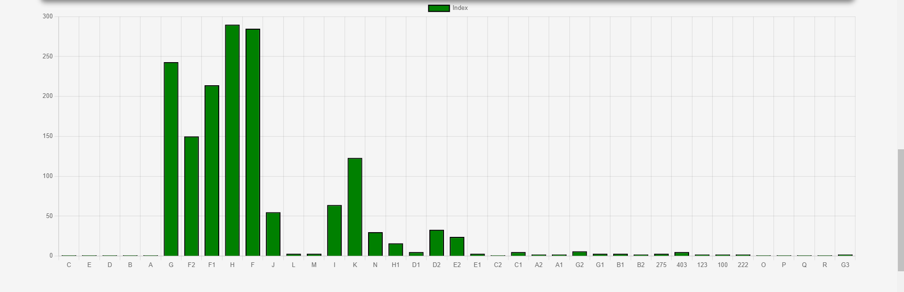
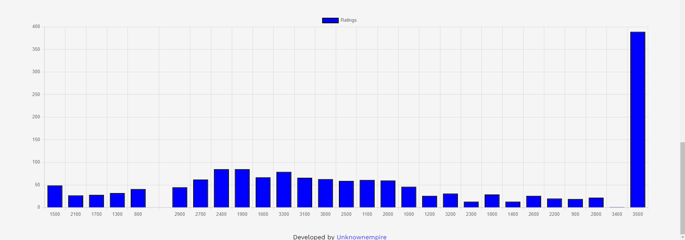
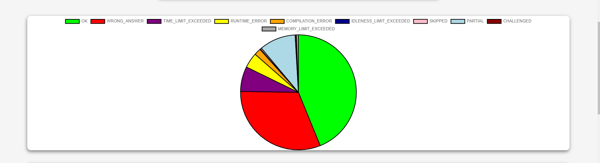
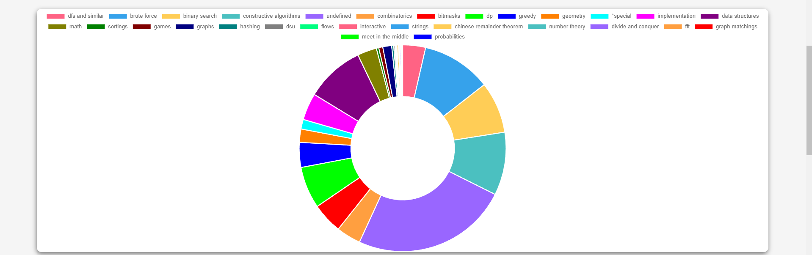

# Progress Tracker 

- Tracks the progress you have made on codeforces till now
    - It displays the number of questions that have been solved so far
    - Pie chart depicting the distribution of solved topics.
- Heat map
    - Tracks question solved on that specific day.

    ### Home Page

    
  ### Bar Graph 
  - Problems solved category wise
   
  - Difficulty Rating of problems solved
  

  ### Pie Chart
  - Verdicts of the user
  

  ### Doughnut Chart
  - Category of problems solved
  